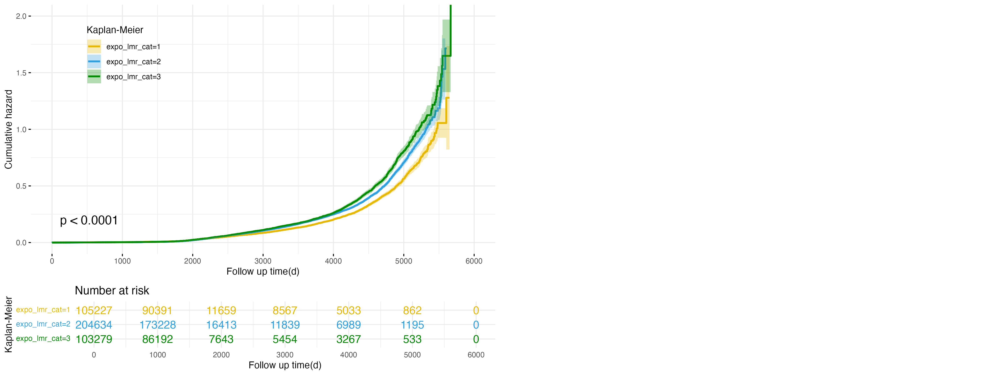

```{r include = FALSE}
library(tidyverse)
library(kableExtra)
```

[View Full Survival Analysis Steps on GitHub](https://github.com/DangLin1214/test4.github.io/blob/main/analysis.R)

### Methodology
Cox proportional hazards models will be employed to investigate the association between exposure categories and survival outcomes. In this study, we will conduct survival analysis to evaluate the relationships between baseline inflammatory and metabolic exposure categories and the risks of developing non-alcoholic fatty liver disease (NAFLD) and cirrhosis. Survival analysis is a statistical approach designed to analyze time-to-event data, where the survival time $T$ (time until the occurrence of the event of interest) and the censoring time $C$ (time at which an observation is no longer tracked) are observed. The observed survival time, denoted as:

$$Y = min(T, C)$$

The censoring indicator $\delta$ is defined as:
$$
\delta =
\begin{cases} 
1 & \text{if } T \leq C \\ 
0 & \text{if } T > C 
\end{cases}
$$
Here, $\delta = 1$ indicates the event was observed, and $\delta = 0$ signifies that censoring occurred.

By modeling survival times and event occurrences, we aim to quantify the impact of different exposure categories on the hazard of developing NAFLD and cirrhosis, adjusting for relevant covariates.

### General Form of the Cox Proportional Hazards Model
We applied the Cox proportional hazards model to evaluate how various covariates influence the hazard rate $h(t)$, which represents the instantaneous risk of the event occurring at time $t$. The hazard function is defined as:

$$h(t) = h_0(t) \exp(x_1\beta_1 + x_2\beta_2 + \dots + x_k\beta_k)$$

Where:

$h(t)$: Hazard function for time t,

$h_0(t)$: Baseline hazard function,

$x_i$: Covariates (e.g., age, sex, inflammatory markers, socioeconomic factors),

$\beta_i$: Regression coefficients for covariates.

### Baseline Characteristics Table
The baseline characteristics are stratified by each exposure category to identify differences in fundamental features across exposure groups and to provide a reference for constructing the Cox proportional hazards model (see [Appendix](appendix.html) for more detailed tables and explanations).

```{r message = FALSE, warning = FALSE}
Baseline_expo_lmr_cat_results <- read_csv("./csv/Baseline_expo_lmr_cat.csv")

Baseline_expo_lmr_cat_cleaned <- Baseline_expo_lmr_cat_results %>%
  select(-test) %>% 
  rename(
    ` ` = ...1, 
    Level1 = `1`, 
    Level2 = `2`,
    Level3 = `3`
  )


knitr::kable(
  Baseline_expo_lmr_cat_cleaned,
  digits = 2,
  caption = "Baseline Characteristics by LMR Exposure Categories",
  align = "c"
) %>%
  kable_styling(full_width = FALSE, position = "center")
```

This table provides the baseline characteristics of participants categorized by Lymphocyte-to-Monocyte Ratio (LMR) levels (Level 1, Level 2, Level 3). It includes demographic (e.g., age, sex), socioeconomic (e.g., income, Townsend index), lifestyle (e.g., smoking, alcohol intake), and clinical markers (e.g., triglycerides, diet quality), highlighting significant differences across categories with p-values for most variables. These differences emphasize potential confounding variables that need adjustment in subsequent statistical models, such as Cox proportional hazards analysis.

<br> 

### Cox Proportional Hazards Models
#### Model 1
$$
h(t) = h_0(t) \exp\left( \beta_{\text{expo}} \times x_{expo} + \beta_{\text{age}} \times x_{age} + \beta_{\text{sex}} \times x_{sex} \right)
$$

#### Model 2
$$
\begin{aligned}
h(t) = h_0(t) \exp\Big( & \beta_{\text{expo}} \times x_{expo} + \beta_{\text{age}} \times x_{age} + \beta_{\text{sex}} \times x_{sex} + \beta_{\text{income}} \times x_{income} \\
& + \beta_{\text{townsend}} \times x_{townsend} + \beta_{\text{total_met}} \times x_{\text{total_met}} + \beta_{\text{diet_quality}} \times x_{\text{diet_quality}} \\
& + \beta_{\text{sleep_hour}} \times x_{\text{sleep_hour}} + \beta_{\text{smoke_cat}} \times x_{\text{smoke_cat}} + \beta_{\text{total_alcohol}} \times x_{\text{total_alcohol}} \\
& + \beta_{\text{no_hdl}} \times x_{\text{no_hdl}} + \beta_{\text{tg}} \times x_{\text{tg}} + \beta_{\text{bp_cat}} \times x_{\text{bp_cat}} \Big)
\end{aligned}
$$

After fitting the Cox proportional hazards models, hazard ratios will be calculated for each exposure category, with the lowest exposure category serving as the reference. Statistical significance will be assessed using p-values, and dose-response relationships will be evaluated through p-for-trend tests. Results will be reported with 95% confidence intervals to convey precision. Survival durations will be computed based on either censored times or event times, with imputation applied where necessary to ensure complete datasets for analysis.

<br> 

### Cumulative Hazard Plots
#### Figure 1: Cumulative Hazard Plot for expo_lmr Categories in NAFLD Outcome


Figure 1 demonstrates the association between lymphocyte-to-monocyte ratio (LMR) exposure categories and the risk of developing non-alcoholic fatty liver disease (NAFLD). The high exposure group (expo_lmr_cat=3, green line) exhibits the highest cumulative hazard throughout the follow-up period, followed by the intermediate (expo_lmr_cat=2, blue line) and low exposure (expo_lmr_cat=1, yellow line) groups. These differences are statistically significant (p < 0.0001), indicating that higher LMR levels are associated with an increased risk of NAFLD. This suggests that elevated LMR, potentially indicative of an immune imbalance, may contribute to the progression of NAFLD.

<br>

#### Figure 2: Cumulative Hazard Plot for expo_lmr Categories in Cirrhosis Outcome


Expanding on the findings for NAFLD, Figure 2 evaluates the relationship between LMR exposure categories and the risk of developing cirrhosis. The high exposure group (expo_lmr_cat=3, green line) again demonstrates the highest cumulative hazard, followed by the intermediate (expo_lmr_cat=2, blue line) and low exposure (expo_lmr_cat=1, yellow line) groups. Although the separation of the curves becomes more evident after approximately 5,000 days, the differences are not statistically significant (p = 0.059). These findings suggest that higher LMR levels may also be associated with an increased risk of cirrhosis, though the evidence is weaker compared to NAFLD.

<br>

#### Figure 3: Cumulative Hazard Plot for SII Exposure in NAFLD Outcome


Building on the role of inflammatory markers, Figure 3 illustrates the relationship between systemic immune-inflammation index (SII) exposure categories and the risk of developing NAFLD. The low exposure group (expo_sii_cat=1, yellow line) exhibits the highest cumulative hazard, followed by the intermediate group (expo_sii_cat=2, blue line), while the high exposure group (expo_sii_cat=3, green line) shows the lowest cumulative hazard. These differences are statistically significant (p < 0.0001), indicating that higher SII levels are associated with a reduced risk of NAFLD. This finding highlights the complex role of systemic inflammation, where individuals with lower SII levels may have an elevated risk of NAFLD.

<br>

#### Figure 4: Cumulative Hazard Plot for SII Exposure in Cirrhosis Outcome


Expanding the analysis to cirrhosis, Figure 4 examines the association between SII exposure categories and cirrhosis risk. Similar to the trend observed in NAFLD, the low exposure group (expo_sii_cat=1, yellow line) shows the highest cumulative hazard, followed by the intermediate group (expo_sii_cat=2, blue line), while the high exposure group (expo_sii_cat=3, green line) consistently demonstrates the lowest cumulative hazard. These differences are statistically significant (p < 0.0001), suggesting that higher SII levels are associated with a reduced risk of cirrhosis. This pattern indicates that systemic inflammation, as reflected by lower SII levels, may play a role in cirrhosis development.

<br>

#### Figure 5: Cumulative Hazard Plot for NPAR Exposure in NAFLD Outcome


Further exploring inflammatory markers, Figure 5 illustrates the relationship between Neutrophil-Percentage-to-Albumin Ratio (NPAR) exposure categories and NAFLD risk. The low exposure group (expo_npar_cat=1, yellow line) exhibits the highest cumulative hazard, followed by the intermediate group (expo_npar_cat=2, blue line), while the high exposure group (expo_npar_cat=3, green line) demonstrates the lowest cumulative hazard. These differences are statistically significant (p < 0.0001), indicating that higher NPAR levels are associated with a reduced risk of NAFLD. These findings emphasize the potential protective role of higher NPAR levels against NAFLD progression.

<br>

#### Figure 6: Cumulative Hazard Plot for NPAR Exposure in Cirrhosis Outcome


Finally, Figure 6 explores the relationship between NPAR exposure categories and the risk of cirrhosis. The low exposure group (expo_npar_cat=1, yellow line) shows the highest cumulative hazard, followed by the intermediate group (expo_npar_cat=2, blue line), while the high exposure group (expo_npar_cat=3, green line) consistently exhibits the lowest cumulative hazard. These differences are statistically significant (p < 0.0001), suggesting that higher NPAR levels are associated with a reduced risk of cirrhosis. This further supports the protective role of higher NPAR levels in mitigating cirrhosis risk, potentially through modulation of systemic inflammation.

<br>

### Results for NAFLD Outcome
```{r message = FALSE, warning = FALSE}
nafld_results <- read_csv("./csv/Main_cox_nafld.csv")

nafld_results_cleaned <- nafld_results %>%
  select(-1, -lower_conf, -upper_conf) %>%
  rename(
    Model = Model,
    `Exposure Category` = Category,
    `Hazard Ratio (HR)` = HR,
    `P-value` = P,
    `P for Trend` = `P for trend`, 
    `Confidence Interval` = CI
  )

nafld_results_cleaned %>%
  knitr::kable(
    digits = 4,
    caption = "Cox Proportional Hazards Results for NAFLD Outcome",
    align = "c" 
  ) %>%
  kable_styling(full_width = FALSE, position = "center")
```


This table presents the results of Cox proportional hazards models evaluating the association between various baseline exposure categories and the risk of developing non-alcoholic fatty liver disease. Each exposure variable (`expo_lmr`, `expo_sii`, `expo_npar`, `expo_nps`) is divided into three categories, with Category 1 (not shown) serving as the reference group (HR = 1.00). The hazard ratios (HRs), confidence intervals (CIs), p-values, and p for trend values are provided for two models: Model 1, adjusted for age and sex, and Model 2, adjusted for additional covariates including socioeconomic and lifestyle factors.

For `expo_lmr`, higher exposure categories (cat2 and cat3) consistently show increased HRs across both models, with slightly higher HRs in Model 2, indicating a stronger association with NAFLD risk after full adjustment. In contrast, for `expo_sii`, `expo_npar`, and `expo_nps`, higher categories exhibit HRs less than 1 in both models, reflecting their protective effects against NAFLD. Notably, the protective effect strengthens slightly in Model 2 for `expo_sii` and `expo_npar`, suggesting that adjusting for additional factors further clarifies their relationship with NAFLD risk. Significant p for trend values across most exposures reinforce robust dose-response relationships, highlighting the importance of these markers in predicting NAFLD.

<br>

### Results for Cirrhosis Outcome
```{r message = FALSE, warning = FALSE}
cirrhosis_results <- read_csv("./csv/Main_cox_cirrhosis.csv")

cirrhosis_results_cleaned <- cirrhosis_results %>%
  select(-1, -lower_conf, -upper_conf) %>%
  rename(
    Model = Model,
    `Exposure Category` = Category,
    `Hazard Ratio (HR)` = HR,
    `P-value` = P,
    `P for Trend` = `P for trend`, 
    `Confidence Interval` = CI
  )

cirrhosis_results_cleaned %>%
  knitr::kable(
    digits = 4,
    caption = "Cox Proportional Hazards Results for Cirrhosis Outcome",
    align = "c" 
  ) %>%
  kable_styling(full_width = FALSE, position = "center")
```

Similarly, this table presents the results of Cox proportional hazards models evaluating the association between various baseline exposure categories and the risk of developing cirrhosis. For `expo_lmr`, higher categories (cat2 and cat3) show HRs slightly below 1 in Model 1, indicating a modest protective effect against cirrhosis, but this effect weakens in Model 2, with HRs approaching 1 and becoming non-significant in some comparisons. In contrast, `expo_sii` demonstrates a strong protective association in both models, with substantially reduced HRs for cat2 and cat3, and slightly stronger effects observed in Model 2 after full adjustment. Similarly, `expo_npar` and `expo_nps` consistently show HRs below 1 in both models, with Model 2 indicating slightly enhanced protective effects compared to Model 1. The significant p for trend values, particularly for `expo_sii` and `expo_nps`, highlight robust dose-response relationships, emphasizing the importance of these markers in mitigating cirrhosis risk.
