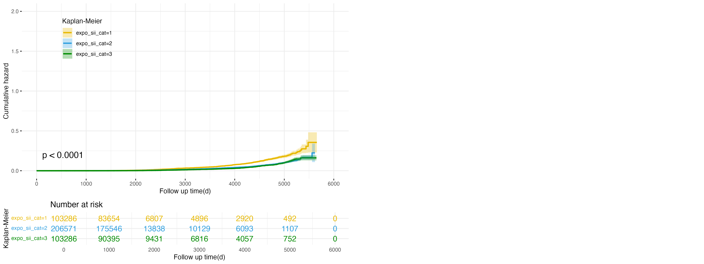
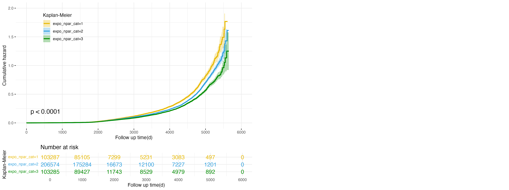
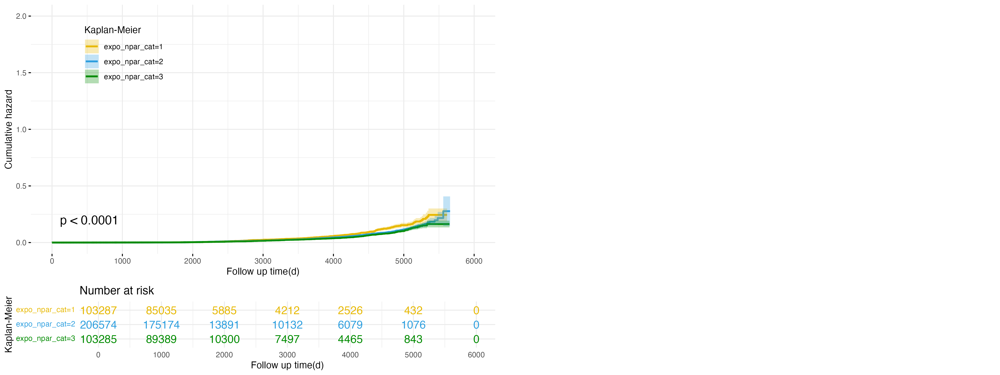

```{r include = FALSE}
library(tidyverse)
library(haven)
library(viridis)
library(RColorBrewer)
library(scales)
library(plotly)
library(patchwork)
library(gridExtra)
library(kableExtra)
```

## Group Members
Zicheng Wang (zw3088), Xiaohui Kang (xk2163), Mengyuan Chen (mc5698), Shuai yuan (sy3270), Dang Lin (dl3757)

<br>

## Motivation 
Chronic diseases like non-alcoholic fatty liver disease (NAFLD), metabolic-associated fatty liver disease (MAFLD), and metabolic-associated steatohepatitis-related liver disease (MASLD) are becoming increasingly common and can progress to cirrhosis, liver failure, or hepatocellular carcinoma. These conditions are closely tied to systemic inflammation and immune dysregulation, making it essential to identify reliable, non-invasive biomarkers that can predict disease progression and provide insights into the underlying mechanisms. Such biomarkers could improve early detection, guide interventions, and support better clinical outcomes.

Immune-related indices like the Lymphocyte-to-Monocyte Ratio (LMR), Systemic Immune-Inflammation Index (SII), Naples Prognostic Score (NPS), and Neutrophil-Percentage-to-Albumin Ratio (NPAR) have gained attention for their potential utility in assessing inflammation and immune responses. These indices are derived from routine blood tests, making them accessible and cost-effective. LMR, for instance, measures the balance between lymphocytes, which are linked to immune surveillance and anti-inflammatory responses, and monocytes, which are associated with inflammation and tissue damage. SII integrates neutrophil, platelet, and lymphocyte counts to provide a comprehensive view of immune activity and thrombosis risk. NPS combines multiple prognostic factors, including inflammatory markers, albumin levels, and platelet counts, offering a broader perspective on patient health. NPAR evaluates the relationship between neutrophil percentages and albumin levels, connecting immune function with nutritional status.

The UK Biobank (UKB) dataset is well-suited for studying the relationships between these immune markers and chronic disease outcomes. With its extensive biomarker, demographic, and longitudinal health data on a representative UK population, the UKB provides an opportunity for detailed cross-sectional and longitudinal analyses. These analyses could help clarify how inflammation and immune stress contribute to chronic disease progression, ultimately advancing both clinical and public health approaches.

<br>

## Related Work
Our project draws inspiration from numerous epidemiological studies that have used the UKB dataset to investigate health outcomes. Prior research has highlighted the dataset's potential for studying associations between lifestyle factors (e.g., alcohol consumption, diet quality, sleep habits) and chronic diseases. Additionally, we were influenced by research methodologies focusing on stratified analyses of biomarkers and demographic variables. This project also builds on techniques discussed in class, such as data visualization, exploratory analysis, and model-based inference.

<br>

## Initial Questions
Our initial questions were designed to explore broad patterns and associations in the UKB dataset:

- How do age and sex influence the distribution of health outcomes?
- Are there observable trends in disease incidence across different levels of alcohol consumption?
- How do blood pressure categories relate to age and disease prevalence?
- Is there a correlation between income levels and diet quality?
- How does sleep duration vary across different age groups?

After conducting exploratory analyses and evaluating the dataset's strengths (e.g., large sample size) and limitations (e.g., underrepresentation of certain subgroups), we refined our questions to focus on specific trends and relationships: 

- Does age distribution vary significantly between sexes in different age groups?
- What is the relationship between alcohol consumption and disease incidence, stratified by sex?
- How do blood pressure and age interact to influence disease incidence rates?
- Is there a positive association between income levels and diet quality?
- How do sleep duration patterns change with age?


## Exploratory Data Analysis
```{r}
ukb_data <- read_dta("./external_data/data_prepared.dta")
```

### Age and Sex Distribution
```{r}
figure_1 <- ukb_data %>%
  mutate(age_group = cut(age, breaks = seq(10, 100, by = 10), right = FALSE, 
                         labels = paste(seq(10, 90, by = 10), "-", 
                                        seq(19, 99, by = 10), sep = ""))) %>%
  ggplot(aes(x = age_group, y = age, fill = as.factor(sex))) + 
  geom_boxplot(alpha = 0.9) + 
  theme_minimal() +
  labs(x = 'Age Groups', 
       y = 'Age',
       title = 'Age Distribution by Sex and Age Groups',
       fill = 'Sex') +
  scale_fill_manual(values = c("lightblue", "lightpink"),
                    labels = c("Female", "Male")) +
  theme(legend.position = "bottom")

figure_1
```

We examined the age distribution of male and female participants across 10-year age groups. In the 30-39 age group, the sample size was relatively small, with median ages and IQRs consistent across sexes. Similar trends were observed in the 40-49 and 50-59 groups. In the 60-69 group, females exhibited slightly higher upper quartiles than males, while the 70-79 group showed broader distributions for females, indicating more variation in ages.

<br>

### Alcohol Consumption and Disease Incidence
```{r message = FALSE}
# Data cleaning
disease_heat2 <- ukb_data %>%
  filter(!is.na(sex), !is.na(total_alcohol), !is.na(nafld_outcome)) %>%
  mutate(
    alcohol_group = cut(total_alcohol, 
                       breaks = c(-Inf, 0, 5, 10, 15, Inf),
                       labels = c("None", "Low", "Medium", "High", "Very High"),
                       include.lowest = TRUE)
  ) %>%
  group_by(sex, alcohol_group) %>%
  summarise(
    disease_rate = mean(nafld_outcome, na.rm = TRUE),
    n = n()
  ) %>%
  ungroup()

ukb_data <- ukb_data %>%
  mutate(
    sex = as_factor(sex), 
    nafld_outcome = as.numeric(as_factor(nafld_outcome)),
    total_alcohol = as.numeric(total_alcohol),
    income = as.numeric(income)
  )

disease_heat2 <- ukb_data %>%
  filter(!is.na(sex), !is.na(total_alcohol), !is.na(nafld_outcome)) %>%
  mutate(
    alcohol_group = cut(total_alcohol, 
                       breaks = c(-Inf, 0, 5, 10, 15, Inf),
                       labels = c("None", "Low", "Medium", "High", "Very High"),
                       include.lowest = TRUE)
  ) %>%
  group_by(sex, alcohol_group) %>%
  summarise(
    disease_rate = mean(nafld_outcome, na.rm = TRUE),
    n = n()
  ) %>%
  ungroup()

# Create heatmap
figure_2 <- ggplot(disease_heat2, aes(x = sex, y = alcohol_group, fill = disease_rate)) +
  geom_tile() +
  scale_fill_gradient(low = "white", high = "red") +
  theme_minimal() +
  labs(title = "Disease Incidence by Sex and Alcohol Consumption",
       x = "Sex",
       y = "Alcohol Consumption Level",
       fill = "Disease Rate") +
  geom_text(aes(label = sprintf("n=%d", n)), color = "black", size = 3)

ggplotly(figure_2)
```

A heatmap analysis revealed an inverse relationship between alcohol consumption and disease incidence. Non-drinkers exhibited the highest disease rates, with males outnumbering females. In contrast, participants with very high alcohol consumption had the lowest disease rates. Across all categories, females demonstrated slightly higher disease rates than males.

<br>

### Blood Pressure and Age Trends
```{r message = FALSE}
# Data Cleaning
disease_heat1 <- ukb_data %>%
  filter(!is.na(age), !is.na(bp_cat), !is.na(nafld_outcome)) %>%
  mutate(
    bp_cat = as_factor(bp_cat),
    age_group = cut(age, 
                   breaks = c(30, 40, 50, 60, 70, 80),
                   labels = c("30-40", "40-50", "50-60", "60-70", "70-80"),
                   include.lowest = TRUE)
  ) %>%
  group_by(age_group, bp_cat) %>%
  summarise(
    disease_rate = mean(nafld_outcome, na.rm = TRUE),
    n = n()
  ) %>%
  ungroup()

# Create heatmap 
figure_4 <- ggplot(disease_heat1, aes(x = age_group, y = bp_cat, fill = disease_rate)) +
  geom_tile() +
  scale_fill_gradient(low = "white", high = "red") +
  theme_minimal() +
  theme(axis.text.x = element_text(angle = 45)) +
  labs(title = "Disease Incidence by Age and Blood Pressure Category",
       x = "Age Groups",
       y = "BP Category",
       fill = "Disease Rate") +
  geom_text(aes(label = sprintf("n=%d", n)), color = "black", size = 3)

ggplotly(figure_4)
```

We observed that disease incidence increased significantly with higher blood pressure, particularly in individuals aged 60 and above. Younger age groups (30-40) showed low disease incidence even at higher blood pressure levels, while middle-aged and older groups demonstrated steeper increases. The largest sample sizes were concentrated in moderate blood pressure categories (BP=40-60).

<br>

### Income and Diet Quality
```{r}
color_palette <- colorRampPalette(c("lightblue", "darkblue"))(length(unique(ukb_data$diet_quality)))

figure_4 <- ukb_data %>%
  filter(!is.na(income) & !is.na(diet_quality)) %>%
  ggplot(aes(x = as.factor(income), fill = as.factor(diet_quality))) +
  geom_bar(position = "stack") +
  theme_minimal() +
  scale_fill_manual(values = color_palette) +
  labs(x = "Income Levels",
       y = "Count",
       fill = "Diet Quality",
       title = "Income vs Diet Quality") +
  theme(legend.position = "bottom")

ggplotly(figure_4)
```

Diet quality showed a positive correlation with income levels. Participants in the highest income bracket had the highest proportions of top diet quality, while those in the lowest income bracket exhibited the poorest diet quality. Middle-income groups displayed more balanced distributions.

<br>

### Sleep Duration Across Age Groups
```{r}
figure_5 <- ukb_data %>% 
  filter(!is.na(age) & !is.na(sleep_hour)) %>%
  mutate(age_group = cut(age, breaks = seq(10, 100, by = 10), right = FALSE, 
                         labels = paste(seq(10, 90, by = 10), "-", 
                                        seq(19, 99, by = 10), sep = ""))) %>%
  ggplot(aes(x = age_group, y = sleep_hour, fill = age_group)) +
  geom_boxplot() +
  theme_minimal() +
  labs(x = "Age Groups", 
       y = "Sleep Hours per Night",
       title = "Sleep Hours per Night by Age Groups",
       fill = "Age Groups") + 
  scale_fill_manual(values = c("lightgreen", "lightpink", "lightblue", 
                               "lightcoral", "lightgoldenrod"))

figure_5
```

Sleep duration varied slightly by age. Younger participants (30-39) had the shortest median sleep duration and the highest prevalence of short sleep (<6 hours). Older age groups (60-69, 70-79) displayed greater variability, with outliers on both ends of the sleep duration spectrum, suggesting more diverse sleep patterns in older adults.

<br> 

### Exposure variables and disease outcomes


### Blood parameters and disease outcomes


# 1
```{r message = FALSE, warning = FALSE}
quantiles <- ukb_data %>%
  group_by(nafld_outcome) %>%
  filter(!is.na(b_lympho)) %>%
  summarize(
    q25 = quantile(b_lympho, 0.25),
    median = median(b_lympho),
    q75 = quantile(b_lympho, 0.75))

figure_14 <- ukb_data %>% 
  group_by(nafld_outcome) %>% 
  filter(!is.na(b_lympho)) %>% 
  mutate(
    lower_bound = quantile(b_lympho, 0.25) - 1.5 * IQR(b_lympho),
    upper_bound = quantile(b_lympho, 0.75) + 1.5 * IQR(b_lympho)
  ) %>%
  filter(b_lympho >= lower_bound & b_lympho <= upper_bound) %>% 
  ggplot(aes(x = b_lympho, fill = as.factor(nafld_outcome))) +
  geom_density(alpha = 0.7) +
  scale_fill_manual(values = c("#BCBDDC", "lightyellow"), name = "NAFLD Outcome", 
                    labels = c("Healthy", "Disease")) +
  labs(
    x = "Lymphocyte",
    y = "Density",
    title = "Density Plot of b_lympho by NAFLD Outcome"
  ) +
  theme_minimal(base_size = 14) + 
  theme(
    legend.position = "bottom",               
    plot.title = element_text(size = 8),      
    axis.title.x = element_text(size = 8),    
    axis.title.y = element_text(size = 8),   
    axis.text.x = element_text(size = 8),     
    axis.text.y = element_text(size = 8), 
    legend.title = element_text(size = 8),      
    legend.text = element_text(size = 8),
    legend.key.size = unit(0.4, "cm")
  ) +  
  geom_vline(data = quantiles, aes(xintercept = q25, 
                                   color = as.factor(nafld_outcome)), 
             linetype = "dashed", size = 0.8, show.legend = FALSE) +
  geom_vline(data = quantiles, aes(xintercept = median, 
                                   color = as.factor(nafld_outcome)), 
             linetype = "solid", size = 1, show.legend = FALSE) +
  geom_vline(data = quantiles, aes(xintercept = q75, 
                                   color = as.factor(nafld_outcome)), 
             linetype = "dashed", size = 0.8, show.legend = FALSE) +
  scale_color_manual(values = c("#8A2BE2", "#FDAE6B"))


quantiles <- ukb_data %>%
  group_by(nafld_outcome) %>%
  filter(!is.na(b_mono)) %>%
  summarize(
    q25 = quantile(b_mono, 0.25),
    median = median(b_mono),
    q75 = quantile(b_mono, 0.75)
  )

figure_15 <-ukb_data %>% 
  group_by(nafld_outcome) %>% 
  filter(!is.na(b_mono)) %>% 
  mutate(
    lower_bound = quantile(b_mono, 0.25) - 1.5 * IQR(b_mono),
    upper_bound = quantile(b_mono, 0.75) + 1.5 * IQR(b_mono)
  ) %>%
  filter(b_mono >= lower_bound & b_mono <= upper_bound) %>% 
  ggplot(aes(x = b_mono, fill = as.factor(nafld_outcome))) +
  geom_density(alpha = 0.7) +
  scale_fill_manual(values = c("#BCBDDC", "lightyellow"), name = "NAFLD Outcome", 
                    labels = c("Healthy", "Disease")) +
  labs(
    x = "Monocytes",
    y = "Density",
    title = "Density Plot of b_mono by NAFLD Outcome"
  ) +
  theme_minimal(base_size = 14) + 
  theme(
    legend.position = "bottom",               
    plot.title = element_text(size = 8),      
    axis.title.x = element_text(size = 8),    
    axis.title.y = element_text(size = 8),   
    axis.text.x = element_text(size = 8),     
    axis.text.y = element_text(size = 8), 
    legend.title = element_text(size = 8),      
    legend.text = element_text(size = 8),
    legend.key.size = unit(0.4, "cm")
  ) +  
  geom_vline(data = quantiles, aes(xintercept = q25, 
                                   color = as.factor(nafld_outcome)), 
             linetype = "dashed", size = 0.8, show.legend = FALSE) +
  geom_vline(data = quantiles, aes(xintercept = median, 
                                   color = as.factor(nafld_outcome)), 
             linetype = "solid", size = 1, show.legend = FALSE) +
  geom_vline(data = quantiles, aes(xintercept = q75, 
                                   color = as.factor(nafld_outcome)), 
             linetype = "dashed", size = 0.8, show.legend = FALSE) +
  scale_color_manual(values = c("#8A2BE2", "#FDAE6B"))

quantiles <- ukb_data %>%
  group_by(nafld_outcome) %>%
  filter(!is.na(b_neutro)) %>%
  summarize(
    q25 = quantile(b_neutro, 0.25),
    median = median(b_neutro),
    q75 = quantile(b_neutro, 0.75)
  )

figure_16 <- ukb_data %>% 
  group_by(nafld_outcome) %>% 
  filter(!is.na(b_neutro)) %>% 
  mutate(
    lower_bound = quantile(b_neutro, 0.25) - 1.5 * IQR(b_neutro),
    upper_bound = quantile(b_neutro, 0.75) + 1.5 * IQR(b_neutro)
  ) %>%
  filter(b_neutro >= lower_bound & b_neutro <= upper_bound) %>% 
  ggplot(aes(x = b_neutro, fill = as.factor(nafld_outcome))) +
  geom_density(alpha = 0.7) +
  scale_fill_manual(values = c("#BCBDDC", "lightyellow"), name = "NAFLD Outcome", 
                    labels = c("Healthy", "Disease")) +
  labs(
    x = "Neutrophils",
    y = "Density",
    title = "Density Plot of b_neutro by NAFLD Outcome"
  ) +
  theme_minimal(base_size = 14) + 
  theme(
    legend.position = "bottom",               
    plot.title = element_text(size = 8),      
    axis.title.x = element_text(size = 8),    
    axis.title.y = element_text(size = 8),   
    axis.text.x = element_text(size = 8),     
    axis.text.y = element_text(size = 8), 
    legend.title = element_text(size = 8),      
    legend.text = element_text(size = 8),
    legend.key.size = unit(0.4, "cm")
  ) +  
  geom_vline(data = quantiles, aes(xintercept = q25, 
                                   color = as.factor(nafld_outcome)), 
             linetype = "dashed", size = 0.8, show.legend = FALSE) +
  geom_vline(data = quantiles, aes(xintercept = median, 
                                   color = as.factor(nafld_outcome)), 
             linetype = "solid", size = 1, show.legend = FALSE) +
  geom_vline(data = quantiles, aes(xintercept = q75, 
                                   color = as.factor(nafld_outcome)), 
             linetype = "dashed", size = 0.8, show.legend = FALSE) +
  scale_color_manual(values = c("#8A2BE2", "#FDAE6B"))


quantiles <- ukb_data %>%
  group_by(nafld_outcome) %>%
  filter(!is.na(b_plate)) %>%
  summarize(
    q25 = quantile(b_plate, 0.25),
    median = median(b_plate),
    q75 = quantile(b_plate, 0.75)
  )

figure_17 <- ukb_data %>% 
  group_by(nafld_outcome) %>% 
  filter(!is.na(b_plate)) %>% 
  mutate(
    lower_bound = quantile(b_plate, 0.25) - 1.5 * IQR(b_plate),
    upper_bound = quantile(b_plate, 0.75) + 1.5 * IQR(b_plate)
  ) %>%
  filter(b_plate >= lower_bound & b_plate <= upper_bound) %>% 
  ggplot(aes(x = b_plate, fill = as.factor(nafld_outcome))) +
  geom_density(alpha = 0.7) +
  scale_fill_manual(values = c("#BCBDDC", "lightyellow"), name = "NAFLD Outcome", 
                    labels = c("Healthy", "Disease")) +
  labs(
    x = "Platelets",
    y = "Density",
    title = "Density Plot of b_plate by NAFLD Outcome"
  ) +
  theme_minimal(base_size = 14) + 
  theme(
    legend.position = "bottom",               
    plot.title = element_text(size = 8),      
    axis.title.x = element_text(size = 8),    
    axis.title.y = element_text(size = 8),   
    axis.text.x = element_text(size = 8),     
    axis.text.y = element_text(size = 8), 
    legend.title = element_text(size = 8),      
    legend.text = element_text(size = 8),
    legend.key.size = unit(0.4, "cm")
  ) +  
  geom_vline(data = quantiles, aes(xintercept = q25, 
                                   color = as.factor(nafld_outcome)), 
             linetype = "dashed", size = 0.8, show.legend = FALSE) +
  geom_vline(data = quantiles, aes(xintercept = median, 
                                   color = as.factor(nafld_outcome)), 
             linetype = "solid", size = 1, show.legend = FALSE) +
  geom_vline(data = quantiles, aes(xintercept = q75, 
                                   color = as.factor(nafld_outcome)), 
             linetype = "dashed", size = 0.8, show.legend = FALSE) +
  scale_color_manual(values = c("#8A2BE2", "#FDAE6B"))

grid.arrange(figure_14, figure_15, figure_16, figure_17, nrow = 2, ncol = 2)
```


# 2
```{r message = FALSE, warning = FALSE}
quantiles <- ukb_data %>%
  group_by(cirrho_outcome) %>%
  filter(!is.na(b_lympho)) %>%
  summarize(
    q25 = quantile(b_lympho, 0.25),
    median = median(b_lympho),
    q75 = quantile(b_lympho, 0.75))

figure_18 <- ukb_data %>% 
  group_by(cirrho_outcome) %>% 
  filter(!is.na(b_lympho)) %>% 
  mutate(
    lower_bound = quantile(b_lympho, 0.25) - 1.5 * IQR(b_lympho),
    upper_bound = quantile(b_lympho, 0.75) + 1.5 * IQR(b_lympho)
  ) %>%
  filter(b_lympho >= lower_bound & b_lympho <= upper_bound) %>% 
  ggplot(aes(x = b_lympho, fill = as.factor(cirrho_outcome))) +
  geom_density(alpha = 0.7) +
  scale_fill_manual(values = c("#BCBDDC", "lightyellow"), name = "Cirrhosis Outcome", 
                    labels = c("Healthy", "Disease")) +
  labs(
    x = "Lymphocyte",
    y = "Density",
    title = "Density Plot of b_lympho by Cirrhosis Outcome"
  ) +
  theme_minimal(base_size = 14) + 
  theme(
    legend.position = "bottom",               
    plot.title = element_text(size = 8),      
    axis.title.x = element_text(size = 8),    
    axis.title.y = element_text(size = 8),   
    axis.text.x = element_text(size = 8),     
    axis.text.y = element_text(size = 8), 
    legend.title = element_text(size = 8),      
    legend.text = element_text(size = 8),
    legend.key.size = unit(0.4, "cm")
  ) +  
  geom_vline(data = quantiles, aes(xintercept = q25, 
                                   color = as.factor(cirrho_outcome)), 
             linetype = "dashed", size = 0.8, show.legend = FALSE) +
  geom_vline(data = quantiles, aes(xintercept = median, 
                                   color = as.factor(cirrho_outcome)), 
             linetype = "solid", size = 1, show.legend = FALSE) +
  geom_vline(data = quantiles, aes(xintercept = q75, 
                                   color = as.factor(cirrho_outcome)), 
             linetype = "dashed", size = 0.8, show.legend = FALSE) +
  scale_color_manual(values = c("#8A2BE2", "#FDAE6B"))


quantiles <- ukb_data %>%
  group_by(cirrho_outcome) %>%
  filter(!is.na(b_mono)) %>%
  summarize(
    q25 = quantile(b_mono, 0.25),
    median = median(b_mono),
    q75 = quantile(b_mono, 0.75)
  )

figure_19 <-ukb_data %>% 
  group_by(cirrho_outcome) %>% 
  filter(!is.na(b_mono)) %>% 
  mutate(
    lower_bound = quantile(b_mono, 0.25) - 1.5 * IQR(b_mono),
    upper_bound = quantile(b_mono, 0.75) + 1.5 * IQR(b_mono)
  ) %>%
  filter(b_mono >= lower_bound & b_mono <= upper_bound) %>% 
  ggplot(aes(x = b_mono, fill = as.factor(cirrho_outcome))) +
  geom_density(alpha = 0.7) +
  scale_fill_manual(values = c("#BCBDDC", "lightyellow"), name = "Cirrhosis Outcome", 
                    labels = c("Healthy", "Disease")) +
  labs(
    x = "Monocytes",
    y = "Density",
    title = "Density Plot of b_mono by Cirrhosis Outcome"
  ) +
  theme_minimal(base_size = 14) + 
  theme(
    legend.position = "bottom",               
    plot.title = element_text(size = 8),      
    axis.title.x = element_text(size = 8),    
    axis.title.y = element_text(size = 8),   
    axis.text.x = element_text(size = 8),     
    axis.text.y = element_text(size = 8), 
    legend.title = element_text(size = 8),      
    legend.text = element_text(size = 8),
    legend.key.size = unit(0.4, "cm")
  ) +  
  geom_vline(data = quantiles, aes(xintercept = q25, 
                                   color = as.factor(cirrho_outcome)), 
             linetype = "dashed", size = 0.8, show.legend = FALSE) +
  geom_vline(data = quantiles, aes(xintercept = median, 
                                   color = as.factor(cirrho_outcome)), 
             linetype = "solid", size = 1, show.legend = FALSE) +
  geom_vline(data = quantiles, aes(xintercept = q75, 
                                   color = as.factor(cirrho_outcome)), 
             linetype = "dashed", size = 0.8, show.legend = FALSE) +
  scale_color_manual(values = c("#8A2BE2", "#FDAE6B"))

quantiles <- ukb_data %>%
  group_by(cirrho_outcome) %>%
  filter(!is.na(b_neutro)) %>%
  summarize(
    q25 = quantile(b_neutro, 0.25),
    median = median(b_neutro),
    q75 = quantile(b_neutro, 0.75)
  )

figure_20 <- ukb_data %>% 
  group_by(cirrho_outcome) %>% 
  filter(!is.na(b_neutro)) %>% 
  mutate(
    lower_bound = quantile(b_neutro, 0.25) - 1.5 * IQR(b_neutro),
    upper_bound = quantile(b_neutro, 0.75) + 1.5 * IQR(b_neutro)
  ) %>%
  filter(b_neutro >= lower_bound & b_neutro <= upper_bound) %>% 
  ggplot(aes(x = b_neutro, fill = as.factor(cirrho_outcome))) +
  geom_density(alpha = 0.7) +
  scale_fill_manual(values = c("#BCBDDC", "lightyellow"), name = "Cirrhosis Outcome", 
                    labels = c("Healthy", "Disease")) +
  labs(
    x = "Neutrophils",
    y = "Density",
    title = "Density Plot of b_neutro by Cirrhosis Outcome"
  ) +
  theme_minimal(base_size = 14) + 
  theme(
    legend.position = "bottom",               
    plot.title = element_text(size = 8),      
    axis.title.x = element_text(size = 8),    
    axis.title.y = element_text(size = 8),   
    axis.text.x = element_text(size = 8),     
    axis.text.y = element_text(size = 8), 
    legend.title = element_text(size = 8),      
    legend.text = element_text(size = 8),
    legend.key.size = unit(0.4, "cm")
  ) +  
  geom_vline(data = quantiles, aes(xintercept = q25, 
                                   color = as.factor(cirrho_outcome)), 
             linetype = "dashed", size = 0.8, show.legend = FALSE) +
  geom_vline(data = quantiles, aes(xintercept = median, 
                                   color = as.factor(cirrho_outcome)), 
             linetype = "solid", size = 1, show.legend = FALSE) +
  geom_vline(data = quantiles, aes(xintercept = q75, 
                                   color = as.factor(cirrho_outcome)), 
             linetype = "dashed", size = 0.8, show.legend = FALSE) +
  scale_color_manual(values = c("#8A2BE2", "#FDAE6B"))


quantiles <- ukb_data %>%
  group_by(cirrho_outcome) %>%
  filter(!is.na(b_plate)) %>%
  summarize(
    q25 = quantile(b_plate, 0.25),
    median = median(b_plate),
    q75 = quantile(b_plate, 0.75)
  )

figure_21 <- ukb_data %>% 
  group_by(cirrho_outcome) %>% 
  filter(!is.na(b_plate)) %>% 
  mutate(
    lower_bound = quantile(b_plate, 0.25) - 1.5 * IQR(b_plate),
    upper_bound = quantile(b_plate, 0.75) + 1.5 * IQR(b_plate)
  ) %>%
  filter(b_plate >= lower_bound & b_plate <= upper_bound) %>% 
  ggplot(aes(x = b_plate, fill = as.factor(cirrho_outcome))) +
  geom_density(alpha = 0.7) +
  scale_fill_manual(values = c("#BCBDDC", "lightyellow"), name = "Cirrhosis Outcome", 
                    labels = c("Healthy", "Disease")) +
  labs(
    x = "Platelets",
    y = "Density",
    title = "Density Plot of b_plate by Cirrhosis Outcome"
  ) +
  theme_minimal(base_size = 14) + 
  theme(
    legend.position = "bottom",               
    plot.title = element_text(size = 8),      
    axis.title.x = element_text(size = 8),    
    axis.title.y = element_text(size = 8),   
    axis.text.x = element_text(size = 8),     
    axis.text.y = element_text(size = 8), 
    legend.title = element_text(size = 8),      
    legend.text = element_text(size = 8),
    legend.key.size = unit(0.4, "cm")
  ) +  
  geom_vline(data = quantiles, aes(xintercept = q25, 
                                   color = as.factor(cirrho_outcome)), 
             linetype = "dashed", size = 0.8, show.legend = FALSE) +
  geom_vline(data = quantiles, aes(xintercept = median, 
                                   color = as.factor(cirrho_outcome)), 
             linetype = "solid", size = 1, show.legend = FALSE) +
  geom_vline(data = quantiles, aes(xintercept = q75, 
                                   color = as.factor(cirrho_outcome)), 
             linetype = "dashed", size = 0.8, show.legend = FALSE) +
  scale_color_manual(values = c("#8A2BE2", "#FDAE6B"))

grid.arrange(figure_18, figure_19, figure_20, figure_21, nrow = 2, ncol = 2)
```


# useful plots
```{r message = FALSE, warning = FALSE}
quantiles <- ukb_data %>%
  group_by(nafld_outcome) %>%
  filter(!is.na(expo_lmr)) %>%
  summarize(
    q25 = quantile(expo_lmr, 0.25),
    median = median(expo_lmr),
    q75 = quantile(expo_lmr, 0.75))

figure_6 <- ukb_data %>% 
  group_by(nafld_outcome) %>% 
  filter(!is.na(expo_lmr)) %>% 
  mutate(
    lower_bound = quantile(expo_lmr, 0.25) - 1.5 * IQR(expo_lmr),
    upper_bound = quantile(expo_lmr, 0.75) + 1.5 * IQR(expo_lmr)
  ) %>%
  filter(expo_lmr >= lower_bound & expo_lmr <= upper_bound) %>% 
  ggplot(aes(x = expo_lmr, fill = as.factor(nafld_outcome))) +
  geom_density(alpha = 0.7) +
  scale_fill_manual(values = c("skyblue", "pink"), name = "NAFLD Outcome", 
                    labels = c("Healthy", "Disease")) +
  labs(
    x = "Lymphocyte-to-Monocyte Ratio (LMR)",
    y = "Density",
    title = "Density Plot of expo_lmr by NAFLD Outcome"
  ) +
  theme_minimal(base_size = 14) + 
  theme(
    legend.position = "bottom",               
    plot.title = element_text(size = 8),      
    axis.title.x = element_text(size = 8),    
    axis.title.y = element_text(size = 8),   
    axis.text.x = element_text(size = 8),     
    axis.text.y = element_text(size = 8), 
    legend.title = element_text(size = 8),      
    legend.text = element_text(size = 8),
    legend.key.size = unit(0.4, "cm")
  ) +  
  geom_vline(data = quantiles, aes(xintercept = q25, 
                                   color = as.factor(nafld_outcome)), 
             linetype = "dashed", size = 0.8, show.legend = FALSE) +
  geom_vline(data = quantiles, aes(xintercept = median, 
                                   color = as.factor(nafld_outcome)), 
             linetype = "solid", size = 1, show.legend = FALSE) +
  geom_vline(data = quantiles, aes(xintercept = q75, 
                                   color = as.factor(nafld_outcome)), 
             linetype = "dashed", size = 0.8, show.legend = FALSE) +
  scale_color_manual(values = c("dodgerblue", "coral"))


quantiles <- ukb_data %>%
  group_by(nafld_outcome) %>%
  filter(!is.na(expo_sii)) %>%
  summarize(
    q25 = quantile(expo_sii, 0.25),
    median = median(expo_sii),
    q75 = quantile(expo_sii, 0.75)
  )

figure_7 <-ukb_data %>% 
  group_by(nafld_outcome) %>% 
  filter(!is.na(expo_sii)) %>% 
  mutate(
    lower_bound = quantile(expo_sii, 0.25) - 1.5 * IQR(expo_sii),
    upper_bound = quantile(expo_sii, 0.75) + 1.5 * IQR(expo_sii)
  ) %>%
  filter(expo_sii >= lower_bound & expo_sii <= upper_bound) %>% 
  ggplot(aes(x = expo_sii, fill = as.factor(nafld_outcome))) +
  geom_density(alpha = 0.7) +
  scale_fill_manual(values = c("skyblue", "pink"), name = "NAFLD Outcome", 
                    labels = c("Healthy", "Disease")) +
  labs(
    x = "Systemic Immune-Inflammation Index (SII)",
    y = "Density",
    title = "Density Plot of expo_sii by NAFLD Outcome"
  ) +
  theme_minimal(base_size = 14) + 
  theme(
    legend.position = "bottom",               
    plot.title = element_text(size = 8),      
    axis.title.x = element_text(size = 8),    
    axis.title.y = element_text(size = 8),   
    axis.text.x = element_text(size = 8),     
    axis.text.y = element_text(size = 8), 
    legend.title = element_text(size = 8),      
    legend.text = element_text(size = 8),
    legend.key.size = unit(0.4, "cm")
  ) +  
  geom_vline(data = quantiles, aes(xintercept = q25, 
                                   color = as.factor(nafld_outcome)), 
             linetype = "dashed", size = 0.8, show.legend = FALSE) +
  geom_vline(data = quantiles, aes(xintercept = median, 
                                   color = as.factor(nafld_outcome)), 
             linetype = "solid", size = 1, show.legend = FALSE) +
  geom_vline(data = quantiles, aes(xintercept = q75, 
                                   color = as.factor(nafld_outcome)), 
             linetype = "dashed", size = 0.8, show.legend = FALSE) +
  scale_color_manual(values = c("dodgerblue", "coral"))

quantiles <- ukb_data %>%
  group_by(nafld_outcome) %>%
  filter(!is.na(expo_npar)) %>%
  summarize(
    q25 = quantile(expo_npar, 0.25),
    median = median(expo_npar),
    q75 = quantile(expo_npar, 0.75)
  )

figure_8 <-ukb_data %>% 
  group_by(nafld_outcome) %>% 
  filter(!is.na(expo_npar)) %>% 
  mutate(
    lower_bound = quantile(expo_npar, 0.25) - 1.5 * IQR(expo_npar),
    upper_bound = quantile(expo_npar, 0.75) + 1.5 * IQR(expo_npar)
  ) %>%
  filter(expo_npar >= lower_bound & expo_npar <= upper_bound) %>% 
  ggplot(aes(x = expo_npar, fill = as.factor(nafld_outcome))) +
  geom_density(alpha = 0.7) +
  scale_fill_manual(values = c("skyblue", "pink"), name = "NAFLD Outcome", 
                    labels = c("Healthy", "Disease")) +
  labs(
    x = "Neutrophil-to-Albumin Ratio (NPAR)",
    y = "Density",
    title = "Density Plot of expo_npar by NAFLD Outcome"
  ) +
  theme_minimal(base_size = 14) + 
  theme(
    legend.position = "bottom",               
    plot.title = element_text(size = 8),      
    axis.title.x = element_text(size = 8),    
    axis.title.y = element_text(size = 8),   
    axis.text.x = element_text(size = 8),     
    axis.text.y = element_text(size = 8), 
    legend.title = element_text(size = 8),      
    legend.text = element_text(size = 8),
    legend.key.size = unit(0.4, "cm")
  ) +  
  geom_vline(data = quantiles, aes(xintercept = q25, 
                                   color = as.factor(nafld_outcome)), 
             linetype = "dashed", size = 0.8, show.legend = FALSE) +
  geom_vline(data = quantiles, aes(xintercept = median, 
                                   color = as.factor(nafld_outcome)), 
             linetype = "solid", size = 1, show.legend = FALSE) +
  geom_vline(data = quantiles, aes(xintercept = q75, 
                                   color = as.factor(nafld_outcome)), 
             linetype = "dashed", size = 0.8, show.legend = FALSE) +
  scale_color_manual(values = c("dodgerblue", "coral"))


figure_9 <-ukb_data %>% 
  filter(!is.na(expo_nps)) %>% 
  group_by(nafld_outcome, expo_nps) %>% 
  summarize(count = n()) %>% 
  ungroup() %>% 
  mutate(total_count = sum(count), 
         percentage = count / total_count * 100) %>%  
  ggplot(aes(x = as.factor(expo_nps), y = percentage, fill = as.factor(nafld_outcome))) +
  geom_bar(stat = "identity", position = position_dodge(width = 0.9), alpha = 0.8) +  
  geom_text(aes(label = paste0(round(percentage, 1), "%")),  
            position = position_dodge(width = 0.9), vjust = 0.75, size = 3) + 
  scale_fill_manual(values = c("skyblue", "pink"), name = "NAFLD Outcome", 
                    labels = c("Healthy", "Disease")) +
  labs(
    x = "Naples Prognostic Score (NPS)",
    y = "Percentage of Total Population",
    title = "Percentage of Total Population by NPS and NAFLD Outcome"
  ) +
  theme_minimal(base_size = 14) +
  theme(
    legend.position = "bottom",               
    plot.title = element_text(size = 8),      
    axis.title.x = element_text(size = 8),    
    axis.title.y = element_text(size = 8),   
    axis.text.x = element_text(size = 8),     
    axis.text.y = element_text(size = 8), 
    legend.title = element_text(size = 8),      
    legend.text = element_text(size = 8),
    legend.key.size = unit(0.4, "cm")
  ) 

grid.arrange(figure_6, figure_7, figure_8, figure_9, nrow = 2, ncol = 2)
```


```{r message = FALSE, warning = FALSE}
quantiles <- ukb_data %>%
  group_by(cirrho_outcome) %>%
  filter(!is.na(expo_lmr)) %>%
  summarize(
    q25 = quantile(expo_lmr, 0.25),
    median = median(expo_lmr),
    q75 = quantile(expo_lmr, 0.75))

figure_10 <- ukb_data %>% 
  group_by(cirrho_outcome) %>% 
  filter(!is.na(expo_lmr)) %>% 
  mutate(
    lower_bound = quantile(expo_lmr, 0.25) - 1.5 * IQR(expo_lmr),
    upper_bound = quantile(expo_lmr, 0.75) + 1.5 * IQR(expo_lmr)
  ) %>%
  filter(expo_lmr >= lower_bound & expo_lmr <= upper_bound) %>% 
  ggplot(aes(x = expo_lmr, fill = as.factor(cirrho_outcome))) +
  geom_density(alpha = 0.7) +
  scale_fill_manual(values = c("skyblue", "pink"), name = "Cirrhosis Outcome", 
                    labels = c("Healthy", "Disease")) +
  labs(
    x = "Lymphocyte-to-Monocyte Ratio (LMR)",
    y = "Density",
    title = "Density Plot of expo_lmr by Cirrhosis Outcome"
  ) +
  theme_minimal(base_size = 14) +
  theme(
    legend.position = "bottom",               
    plot.title = element_text(size = 8),      
    axis.title.x = element_text(size = 8),    
    axis.title.y = element_text(size = 8),   
    axis.text.x = element_text(size = 8),     
    axis.text.y = element_text(size = 8), 
    legend.title = element_text(size = 8),      
    legend.text = element_text(size = 8),
    legend.key.size = unit(0.4, "cm")
  )  + 
  geom_vline(data = quantiles, aes(xintercept = q25, 
                                   color = as.factor(cirrho_outcome)), 
             linetype = "dashed", size = 0.8, show.legend = FALSE) +
  geom_vline(data = quantiles, aes(xintercept = median, 
                                   color = as.factor(cirrho_outcome)), 
             linetype = "solid", size = 1, show.legend = FALSE) +
  geom_vline(data = quantiles, aes(xintercept = q75, 
                                   color = as.factor(cirrho_outcome)), 
             linetype = "dashed", size = 0.8, show.legend = FALSE) +
  scale_color_manual(values = c("dodgerblue", "coral"))

quantiles <- ukb_data %>%
  group_by(cirrho_outcome) %>%
  filter(!is.na(expo_sii)) %>%
  summarize(
    q25 = quantile(expo_sii, 0.25),
    median = median(expo_sii),
    q75 = quantile(expo_sii, 0.75)
  )

figure_11 <- ukb_data %>% 
  group_by(cirrho_outcome) %>% 
  filter(!is.na(expo_sii)) %>% 
  mutate(
    lower_bound = quantile(expo_sii, 0.25) - 1.5 * IQR(expo_sii),
    upper_bound = quantile(expo_sii, 0.75) + 1.5 * IQR(expo_sii)
  ) %>%
  filter(expo_sii >= lower_bound & expo_sii <= upper_bound) %>% 
  ggplot(aes(x = expo_sii, fill = as.factor(cirrho_outcome))) +
  geom_density(alpha = 0.7) +
  scale_fill_manual(values = c("skyblue", "pink"), name = "Cirrhosis Outcome", 
                    labels = c("Healthy", "Disease")) +
  labs(
    x = "Systemic Immune-Inflammation Index (SII)",
    y = "Density",
    title = "Density Plot of expo_sii by Cirrhosis Outcome"
  ) +
  theme_minimal(base_size = 14) +
  theme(
    legend.position = "bottom",               
    plot.title = element_text(size = 8),      
    axis.title.x = element_text(size = 8),    
    axis.title.y = element_text(size = 8),   
    axis.text.x = element_text(size = 8),     
    axis.text.y = element_text(size = 8), 
    legend.title = element_text(size = 8),      
    legend.text = element_text(size = 8),
    legend.key.size = unit(0.4, "cm")
  )  + 
  geom_vline(data = quantiles, aes(xintercept = q25, 
                                   color = as.factor(cirrho_outcome)), 
             linetype = "dashed", size = 0.8, show.legend = FALSE) +
  geom_vline(data = quantiles, aes(xintercept = median, 
                                   color = as.factor(cirrho_outcome)), 
             linetype = "solid", size = 1, show.legend = FALSE) +
  geom_vline(data = quantiles, aes(xintercept = q75, 
                                   color = as.factor(cirrho_outcome)), 
             linetype = "dashed", size = 0.8, show.legend = FALSE) +
  scale_color_manual(values = c("dodgerblue", "coral"))

quantiles <- ukb_data %>%
  group_by(cirrho_outcome) %>%
  filter(!is.na(expo_npar)) %>%
  summarize(
    q25 = quantile(expo_npar, 0.25),
    median = median(expo_npar),
    q75 = quantile(expo_npar, 0.75)
  )

figure_12 <- ukb_data %>% 
  group_by(cirrho_outcome) %>% 
  filter(!is.na(expo_npar)) %>% 
  mutate(
    lower_bound = quantile(expo_npar, 0.25) - 1.5 * IQR(expo_npar),
    upper_bound = quantile(expo_npar, 0.75) + 1.5 * IQR(expo_npar)
  ) %>%
  filter(expo_npar >= lower_bound & expo_npar <= upper_bound) %>% 
  ggplot(aes(x = expo_npar, fill = as.factor(cirrho_outcome))) +
  geom_density(alpha = 0.7) +
  scale_fill_manual(values = c("skyblue", "pink"), name = "Cirrhosis Outcome", 
                    labels = c("Healthy", "Disease")) +
  labs(
    x = "Neutrophil-to-Albumin Ratio (NPAR)",
    y = "Density",
    title = "Density Plot of expo_npar by Cirrhosis Outcome"
  ) +
  theme_minimal(base_size = 14) +
  theme(
    legend.position = "bottom",               
    plot.title = element_text(size = 8),      
    axis.title.x = element_text(size = 8),    
    axis.title.y = element_text(size = 8),   
    axis.text.x = element_text(size = 8),     
    axis.text.y = element_text(size = 8), 
    legend.title = element_text(size = 8),      
    legend.text = element_text(size = 8),
    legend.key.size = unit(0.4, "cm")
  )  + 
  geom_vline(data = quantiles, aes(xintercept = q25, 
                                   color = as.factor(cirrho_outcome)), 
             linetype = "dashed", size = 0.8, show.legend = FALSE) +
  geom_vline(data = quantiles, aes(xintercept = median, 
                                   color = as.factor(cirrho_outcome)), 
             linetype = "solid", size = 1, show.legend = FALSE) +
  geom_vline(data = quantiles, aes(xintercept = q75, 
                                   color = as.factor(cirrho_outcome)), 
             linetype = "dashed", size = 0.8, show.legend = FALSE) +
  scale_color_manual(values = c("dodgerblue", "coral"))

figure_13 <- ukb_data %>% 
  filter(!is.na(expo_nps)) %>% 
  group_by(cirrho_outcome, expo_nps) %>% 
  summarize(count = n()) %>% 
  ungroup() %>% 
  mutate(total_count = sum(count), 
         percentage = count / total_count * 100) %>%  
  ggplot(aes(x = as.factor(expo_nps), y = percentage, fill = as.factor(cirrho_outcome))) +
  geom_bar(stat = "identity", position = position_dodge(width = 0.9), alpha = 0.8) +  
  geom_text(aes(label = paste0(round(percentage, 1), "%")),  
            position = position_dodge(width = 0.9), vjust = 0.5, size = 3) + 
  scale_fill_manual(values = c("skyblue", "pink"), name = "Cirrhosis Outcome", 
                    labels = c("Healthy", "Disease")) +
  labs(
    x = "Naples Prognostic Score (NPS)",
    y = "Percentage of Total Population",
    title = "Percentage of Total Population by NPS and Cirrhosis Outcome"
  ) +
  theme_minimal(base_size = 14) +
  theme(
    legend.position = "bottom",               
    plot.title = element_text(size = 8),      
    axis.title.x = element_text(size = 8),    
    axis.title.y = element_text(size = 8),   
    axis.text.x = element_text(size = 8),     
    axis.text.y = element_text(size = 8), 
    legend.title = element_text(size = 8),      
    legend.text = element_text(size = 8),
    legend.key.size = unit(0.4, "cm")
  ) 

grid.arrange(figure_10, figure_11, figure_12, figure_13, nrow = 2, ncol = 2)
```


## Survival Analysis
[View Full Survival Analysis Steps on GitHub](https://github.com/DangLin1214/test4.github.io/blob/main/analysis.R)

### Methodology
Cox proportional hazards models will be employed to investigate the association between exposure categories and survival outcomes. In this study, we will conduct survival analysis to evaluate the relationships between baseline inflammatory and metabolic exposure categories and the risks of developing non-alcoholic fatty liver disease (NAFLD) and cirrhosis. Survival analysis is a statistical approach designed to analyze time-to-event data, where the survival time $T$ (time until the occurrence of the event of interest) and the censoring time $C$ (time at which an observation is no longer tracked) are observed. The observed survival time, denoted as:

$$Y = min(T, C)$$

The censoring indicator $\delta$ is defined as:
$$
\delta =
\begin{cases} 
1 & \text{if } T \leq C \\ 
0 & \text{if } T > C 
\end{cases}
$$
Here, $\delta = 1$ indicates the event was observed, and $\delta = 0$ signifies that censoring occurred.

By modeling survival times and event occurrences, we aim to quantify the impact of different exposure categories on the hazard of developing NAFLD and cirrhosis, adjusting for relevant covariates.

### General Form of the Cox Proportional Hazards Model
We applied the Cox proportional hazards model to evaluate how various covariates influence the hazard rate $h(t)$, which represents the instantaneous risk of the event occurring at time $t$. The hazard function is defined as:

$$h(t) = h_0(t) \exp(x_1\beta_1 + x_2\beta_2 + \dots + x_k\beta_k)$$

Where:

$h(t)$: Hazard function for time t,

$h_0(t)$: Baseline hazard function,

$x_i$: Covariates (e.g., age, sex, inflammatory markers, socioeconomic factors),

$\beta_i$: Regression coefficients for covariates.

### Baseline Characteristics Table
The baseline characteristics are stratified by each exposure category to identify differences in fundamental features across exposure groups and to provide a reference for constructing the Cox proportional hazards model (see [Appendix](appendix.html) for more detailed tables and explanations).

```{r message = FALSE, warning = FALSE}
Baseline_expo_lmr_cat_results <- read_csv("./csv/Baseline_expo_lmr_cat.csv")

Baseline_expo_lmr_cat_cleaned <- Baseline_expo_lmr_cat_results %>%
  select(-test) %>% 
  rename(
    ` ` = ...1, 
    Level1 = `1`, 
    Level2 = `2`,
    Level3 = `3`
  )


knitr::kable(
  Baseline_expo_lmr_cat_cleaned,
  digits = 2,
  caption = "Baseline Characteristics by LMR Exposure Categories",
  align = "c"
) %>%
  kable_styling(full_width = FALSE, position = "center")
```

This table provides the baseline characteristics of participants categorized by Lymphocyte-to-Monocyte Ratio (LMR) levels (Level 1, Level 2, Level 3). It includes demographic (e.g., age, sex), socioeconomic (e.g., income, Townsend index), lifestyle (e.g., smoking, alcohol intake), and clinical markers (e.g., triglycerides, diet quality), highlighting significant differences across categories with p-values for most variables. These differences emphasize potential confounding variables that need adjustment in subsequent statistical models, such as Cox proportional hazards analysis.

<br> 

### Cox Proportional Hazards Models
#### Model 1
$$
h(t) = h_0(t) \exp\left( \beta_{\text{expo}} \times x_{expo} + \beta_{\text{age}} \times x_{age} + \beta_{\text{sex}} \times x_{sex} \right)
$$

#### Model 2
$$
\begin{aligned}
h(t) = h_0(t) \exp\Big( & \beta_{\text{expo}} \times x_{expo} + \beta_{\text{age}} \times x_{age} + \beta_{\text{sex}} \times x_{sex} + \beta_{\text{income}} \times x_{income} \\
& + \beta_{\text{townsend}} \times x_{townsend} + \beta_{\text{total_met}} \times x_{\text{total_met}} + \beta_{\text{diet_quality}} \times x_{\text{diet_quality}} \\
& + \beta_{\text{sleep_hour}} \times x_{\text{sleep_hour}} + \beta_{\text{smoke_cat}} \times x_{\text{smoke_cat}} + \beta_{\text{total_alcohol}} \times x_{\text{total_alcohol}} \\
& + \beta_{\text{no_hdl}} \times x_{\text{no_hdl}} + \beta_{\text{tg}} \times x_{\text{tg}} + \beta_{\text{bp_cat}} \times x_{\text{bp_cat}} \Big)
\end{aligned}
$$

After fitting the Cox proportional hazards models, hazard ratios (HRs) will be calculated for each exposure category, with the lowest exposure category serving as the reference. Statistical significance will be assessed using p-values, and dose-response relationships will be evaluated through p-for-trend tests. Results will be reported with 95% confidence intervals (CIs) to convey precision. Survival durations will be computed based on either censored times or event times, with imputation applied where necessary to ensure complete datasets for analysis.

<br> 

## Cumulative Hazard Plots
#### Cumulative Hazard Plot for expo_lmr Categories in NAFLD Outcome


The cumulative hazard plot shows the association between lymphocyte-to-monocyte ratio (LMR) exposure categories and the risk of developing non-alcoholic fatty liver disease (NAFLD) over time. The three exposure categories (level 1, level 2, and level 3) display distinct cumulative hazard trends, with the high exposure group (level 3, yellow line) showing the steepest increase, indicating the highest risk of NAFLD. The low exposure group (level 1, green line) has the slowest cumulative hazard growth, suggesting the lowest risk, while the intermediate group (level 2, blue line) lies between the two. The separation of curves is statistically significant (p < 0.0001), demonstrating a strong dose-response relationship, where higher LMR exposure corresponds to greater NAFLD risk. These findings highlight the role of inflammation, as reflected by LMR, in driving the development of NAFLD.

<br>

#### Cumulative Hazard Plot for expo_lmr Categories in Cirrhosis Outcome


The cumulative hazard plot depicts the relationship between lymphocyte-to-monocyte ratio (LMR) exposure categories and the risk of developing cirrhosis over time. The three exposure categories (level 1, level 2, and level 3) show minimal separation in cumulative hazard curves throughout most of the follow-up period, with a slight divergence occurring after approximately 5,000 days. The high exposure group (level 3, yellow line) exhibits a marginally higher cumulative hazard compared to the intermediate (level 2, blue line) and low exposure groups (level 1, green line). However, the overall difference among the exposure groups is not statistically significant (p = 0.059), suggesting limited evidence to support an association between LMR exposure categories and cirrhosis risk within the observed follow-up period.

<br>

#### Cumulative Hazard Plot for SII Exposure in NAFLD Outcome


The cumulative hazard plot illustrates the relationship between systemic immune-inflammation index (SII) exposure categories and the risk of developing non-alcoholic fatty liver disease (NAFLD) over time. The three exposure categories (level 1, level 2, and level 3) display distinct trends, with the high exposure group (level 3, yellow line) showing the steepest cumulative hazard increase, indicating the highest risk of NAFLD. The low exposure group (level 1, green line) exhibits the slowest cumulative hazard growth, reflecting the lowest risk, while the intermediate group (level 2, blue line) lies between the two. The differences in cumulative hazard among the groups are statistically significant (p < 0.0001), highlighting a clear dose-response relationship. These findings underscore the importance of systemic inflammation, as captured by SII, as a significant risk factor for NAFLD development.

<br>

#### Cumulative Hazard Plot for SII Exposure in Cirrhosis Outcome


The cumulative hazard plot shows the relationship between systemic immune-inflammation index (SII) exposure categories and the risk of developing cirrhosis over time. The three exposure categories (level 1, level 2, and level 3) exhibit increasing cumulative hazard trends, with the high exposure group (level 3, yellow line) showing the steepest increase in cumulative hazard, indicating the highest risk of cirrhosis. The low exposure group (level 1, green line) has the slowest cumulative hazard growth, suggesting the lowest risk, while the intermediate group (level 2, blue line) falls between the two. The differences among the exposure groups are statistically significant (p < 0.0001), demonstrating a strong association between higher SII levels and increased risk of cirrhosis. These findings highlight systemic inflammation, as measured by SII, as an important risk factor for cirrhosis.

<br>

#### Cumulative Hazard Plot for SII Exposure in NAFLD Outcome


The cumulative hazard plot illustrates the association between systemic immune-inflammation index (SII) exposure categories and the risk of developing non-alcoholic fatty liver disease (NAFLD) over time. The three exposure categories (level 1, level 2, and level 3) show clear separation in cumulative hazard trends, with the high exposure group (level 3, yellow line) exhibiting the steepest increase in cumulative hazard, indicating the highest risk of NAFLD. The low exposure group (level 1, green line) demonstrates the slowest cumulative hazard growth, reflecting the lowest risk, while the intermediate group (level 2, blue line) lies between the two. The differences among the exposure groups are statistically significant (p < 0.0001), highlighting a strong relationship between higher SII levels and increased risk of NAFLD. These findings emphasize the critical role of systemic inflammation, as measured by SII, in influencing NAFLD development.

<br>

#### Cumulative Hazard Plot for NPAR Exposure in Cirrhosis Outcome


The cumulative hazard plot shows the relationship between neutrophil-to-albumin ratio (NPAR) exposure categories and the risk of developing cirrhosis over time. The three exposure categories (level 1, level 2, and level 3) demonstrate increasing cumulative hazard trends, with the high exposure group (level 3, yellow line) exhibiting the steepest cumulative hazard increase, indicating the highest risk of cirrhosis. The low exposure group (level 1, green line) shows the slowest cumulative hazard growth, reflecting the lowest risk, while the intermediate group (level 2, blue line) lies between the two. The differences among the groups are statistically significant (p < 0.0001), suggesting a strong association between higher NPAR levels and an increased risk of cirrhosis. These findings highlight the potential role of elevated NPAR as a marker for cirrhosis risk.

<br>

### Results for NAFLD Outcome
```{r message = FALSE, warning = FALSE}
nafld_results <- read_csv("./csv/Main_cox_nafld.csv")

nafld_results_cleaned <- nafld_results %>%
  select(-1, -lower_conf, -upper_conf) %>%
  rename(
    Model = Model,
    `Exposure Category` = Category,
    `Hazard Ratio (HR)` = HR,
    `P-value` = P,
    `P for Trend` = `P for trend`, 
    `Confidence Interval` = CI
  )

nafld_results_cleaned %>%
  knitr::kable(
    digits = 4,
    caption = "Cox Proportional Hazards Results for NAFLD Outcome",
    align = "c" 
  ) %>%
  kable_styling(full_width = FALSE, position = "center")
```

The analysis of the non-alcoholic fatty liver disease (NAFLD) results revealed significant associations between baseline inflammatory marker categories (e.g., expo_sii, expo_nps) and NAFLD risk. In Model 1, which adjusted for age and sex only, higher exposure categories (Category 2 and Category 3) showed elevated hazard ratios (HRs) compared to Category 1 (reference group, HR = 1). This indicates a progressive increase in NAFLD risk with higher inflammatory marker levels. For instance, participants in Category 3 for expo_sii demonstrated an HR exceeding 1.5, signifying a 50% greater risk relative to the reference.

Model 2, incorporating additional adjustments for socioeconomic (income, Townsend score) and lifestyle factors (diet quality, smoking status, alcohol consumption, etc.), revealed similarly elevated HRs for higher categories. The consistency between the two models suggests robust associations, underscored by statistically significant p for trend values (<0.0001). This highlights a dose-response relationship, where increasing inflammatory marker levels strongly correlate with heightened NAFLD risk. The lower boundary of HRs in Category 1 and narrower confidence intervals (CIs) underscore the protective role of minimal exposure levels.

<br>

### Results for Cirrhosis Outcome
```{r message = FALSE, warning = FALSE}
cirrhosis_results <- read_csv("./csv/Main_cox_cirrhosis.csv")

cirrhosis_results_cleaned <- cirrhosis_results %>%
  select(-1, -lower_conf, -upper_conf) %>%
  rename(
    Model = Model,
    `Exposure Category` = Category,
    `Hazard Ratio (HR)` = HR,
    `P-value` = P,
    `P for Trend` = `P for trend`, 
    `Confidence Interval` = CI
  )

cirrhosis_results_cleaned %>%
  knitr::kable(
    digits = 4,
    caption = "Cox Proportional Hazards Results for Cirrhosis Outcome",
    align = "c" 
  ) %>%
  kable_styling(full_width = FALSE, position = "center")
```

The cirrhosis analysis revealed a similar pattern of associations between baseline exposure categories and time-to-event outcomes. In Model 1, higher categories of inflammatory markers (expo_sii, expo_nps) showed significant HRs above 1, indicating increased cirrhosis risk compared to Category 1. For example, participants in Category 3 of expo_nps displayed an HR close to 2.0, suggesting a twofold increase in risk.

When adjusted further in Model 2, incorporating a comprehensive set of confounders, these associations remained significant, reinforcing the importance of inflammatory markers in predicting cirrhosis outcomes. The dose-response trends are evidenced by the highly significant p for trend values (all <0.001). The results also indicate that the inclusion of socioeconomic and behavioral factors slightly attenuated the HRs but did not alter their overall significance, highlighting the independent contribution of inflammatory markers to cirrhosis risk.

<br> 

## Discussion

Our analysis offers valuable insights into the demographic, lifestyle, and health factors influencing disease outcomes. Age and sex distributions showed consistent trends, with older age groups displaying greater variability in health outcomes, reflecting longevity and disparities in access to healthcare. The inverse association between alcohol consumption and disease incidence among non-drinkers suggests potential confounding by underlying health conditions, such as abstinence due to pre-existing illnesses, emphasizing the need to consider these factors in behavioral assessments.

Blood pressure emerged as a critical predictor of disease risk, highlighting the importance of hypertension management, particularly in older adults. Socioeconomic disparities were evident, with a positive correlation between income and diet quality reflecting broader inequities in health behaviors and access to nutritious food. Sleep duration patterns varied across age groups, with shorter durations among younger participants and greater variability in older adults, potentially linked to lifestyle factors and age-related changes in circadian rhythms. These findings underscore the complex interplay of demographic and behavioral factors influencing health.

The survival analysis further illuminated the associations between baseline exposure categories (sii_cat, nps_cat, npar_cat, and lmr_cat) and health outcomes. Kaplan-Meier survival curves revealed distinct trends, with participants in low exposure categories demonstrating the highest survival probabilities throughout the follow-up, suggesting a protective effect against adverse health outcomes. In contrast, those in high exposure categories exhibited the steepest declines in survival, with clear separations from other groups, indicating a significant association between increased exposure levels and elevated risk. These findings were supported by statistical tests (p-values < 0.001), affirming the robustness of the observed dose-response relationships.

Intermediate exposure groups showed moderate survival declines, reflecting incremental increases in risk. Survival curves for these groups revealed a steady deterioration compared to low exposure groups, albeit less severe than those in high exposure categories. These results highlight the continuum of risk associated with varying exposure levels and the critical need for targeted interventions to mitigate exposure and improve health outcomes.

Demographic and behavioral variables, including age, income, diet quality, and smoking status, played pivotal roles in shaping survival trends. Older participants and individuals with lower incomes were overrepresented in higher exposure categories, exacerbating their vulnerability to adverse outcomes. Similarly, poor dietary habits and higher smoking prevalence in intermediate and high exposure groups compounded survival disparities. These findings collectively emphasize the importance of addressing both exposure levels and underlying socioeconomic and behavioral determinants to enhance population health and reduce disparities in outcomes.


## Conclusion
This analysis integrates insights from EDA and survival modeling to highlight the multifaceted drivers of health outcomes. Demographic, socioeconomic, and behavioral factors interact with baseline exposures to shape survival probabilities. Addressing high-risk exposures, coupled with efforts to reduce socioeconomic inequities, is essential for improving health outcomes. These findings provide a foundation for future research to refine intervention strategies and inform public health policies targeting vulnerable populations.

<br> 

## Appendix
### Baseline Characteristics by LMR Exposure Categories
```{r message = FALSE, warning = FALSE}
Baseline_expo_lmr_cat_results <- read_csv("./csv/Baseline_expo_lmr_cat.csv")

Baseline_expo_lmr_cat_cleaned <- Baseline_expo_lmr_cat_results %>%
  select(-test) %>% 
  rename(
    ` ` = ...1, 
    Level1 = `1`, 
    Level2 = `2`,
    Level3 = `3`
  )

knitr::kable(
  Baseline_expo_lmr_cat_cleaned,
  digits = 2,
  caption = "Baseline Characteristics by LMR Exposure Categories",
  align = "c"
) %>%
  kable_styling(full_width = FALSE, position = "center")
```

### Baseline Characteristics by SII Exposure Categories
```{r message = FALSE, warning = FALSE}
Baseline_expo_sii_cat_results <- read_csv("./csv/Baseline_expo_sii_cat.csv")

Baseline_expo_sii_cat_cleaned <- Baseline_expo_sii_cat_results %>%
  select(-test) %>% 
  rename(
    ` ` = ...1, 
    Level1 = `1`, 
    Level2 = `2`,
    Level3 = `3`
  )

knitr::kable(
  Baseline_expo_sii_cat_cleaned,
  digits = 2,
  caption = "Baseline Characteristics by SII Exposure Categories",
  align = "c"
) %>%
  kable_styling(full_width = FALSE, position = "center")
```

### Baseline Characteristics by NPAR Exposure Categories
```{r message = FALSE, warning = FALSE}
Baseline_expo_npar_cat_results <- read_csv("./csv/Baseline_expo_npar_cat.csv")

Baseline_expo_npar_cat_cleaned <- Baseline_expo_npar_cat_results %>%
  select(-test) %>%
  rename(
    ` ` = ...1,
    Level1 = `1`,
    Level2 = `2`,
    Level3 = `3`
  )

knitr::kable(
  Baseline_expo_npar_cat_cleaned,
  digits = 2,
  caption = "Baseline Characteristics by NPAR Exposure Categories",
  align = "c"
) %>%
  kable_styling(full_width = FALSE, position = "center")

```

### Baseline Characteristics by NPS Exposure Categories
```{r message = FALSE, warning = FALSE}
Baseline_expo_nps_cat_results <- read_csv("./csv/Baseline_expo_nps_cat.csv")

Baseline_expo_nps_cat_cleaned <- Baseline_expo_nps_cat_results %>%
  select(-test) %>%
  rename(
    ` ` = ...1,
    Level1 = `1`,
    Level2 = `2`
  )

knitr::kable(
  Baseline_expo_nps_cat_cleaned,
  digits = 2,
  caption = "Baseline Characteristics by NPS Exposure Categories",
  align = "c"
) %>%
  kable_styling(full_width = FALSE, position = "center")

```

The baseline characteristics tables present a comprehensive summary of the study population stratified by four key exposure categories: Lymphocyte-to-Monocyte Ratio (LMR), Systemic Immune-Inflammation Index (SII), Neutrophil-to-Albumin Ratio (NPAR), and Naples Prognostic Score (NPS). These tables outline demographic variables (e.g., age, sex), socioeconomic factors (e.g., income, Townsend index), lifestyle behaviors (e.g., smoking, alcohol intake), and clinical markers (e.g., triglycerides, diet quality), while highlighting statistically significant differences across exposure levels for most variables. These differences underscore the potential influence of these covariates on the outcomes, necessitating their adjustment in subsequent analyses, such as Cox proportional hazards modeling, to mitigate confounding and ensure robust evaluation of exposure-outcome relationships.


